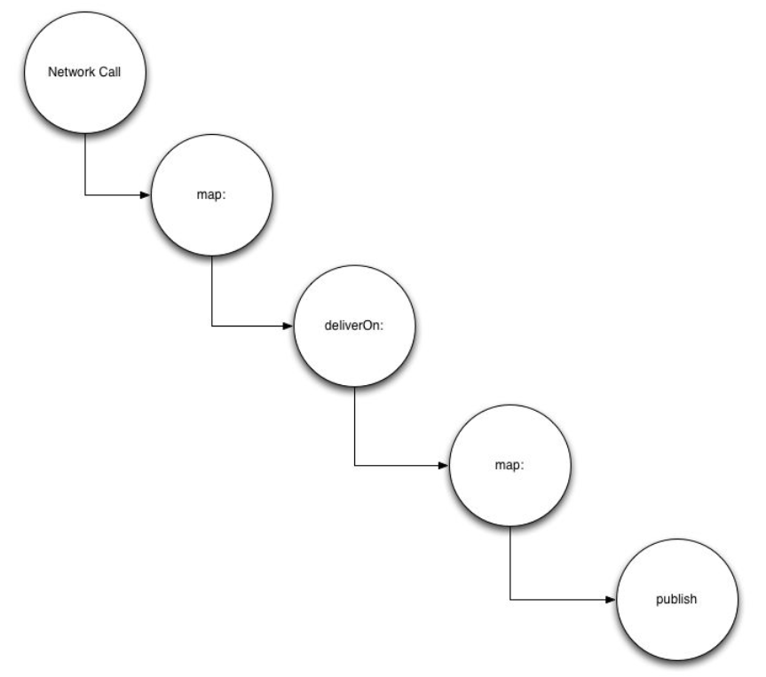

# 网络层回访

还有一个机会来进一步接受我们函数反应型编程的理念，那就是我们的网络层 `FRPPhotoImporter`,我们先来看看下载图片的方法：

```objective-c
+ (void)downloadThumbnailForPhotoModel:(FRPPhotoModel *)photoModel {
	[self download:photoModel.thumbnailURL withCompletion:^(NSData *data) {
		photoModel.thumbnailData = data;
	}];
}

+ (void)downloadFullsizedImageForPhotoModel:(FRPPhotoModel *)photoModel {
	[self download:photoModel.fullsizedURL withCompletion:^(NSData *data){
		photoModel.fullsizedData = data;
	}];
}

+ (void)download:(NSString *)urlString withCompletion:(void (^)(NSData *data))completion {
	NSAssert(urlString, @"URL must not be nil");

	NSURLRequest *request = [NSURLRequest requestWithURL:[NSURL URLWithString:urlString]];
	[NSURLConnection sendAsynchronousRequest:request
								queue:[NSOperationQueue mainQueue]
								completionHandler:
									 ^(NSURLResponse *response, NSData *data, NSError *connectionError) {
											if(completion) {
												completion(data);
											}
									 }];
}

```
Completion blocks?这是另外一个使用Signals的机会。更深入一点来说，我们可以使用`NSURLConnection`的ReactiveCocoa的扩展。下面我们来重写上面的方法：

```
+ (void)downloadThumbnailForPhotoModel:(FRPPhotoModel *)photoModel {
	RAC(photoModel, thumbnailData) = [self download:photoModel.thumbnailURL];
}

+ (void)downloadFullsizedImageForPhotoModel:(FRPPhotoModel *)photoModel {
	RAC(photoModel,fullsizedData) = [self download:photoModel.fullsizedURL];
}

+ (RACSignal *)download:(NSString *)urlString {
	NSAssert(urlString , @"URL must not be nil");

	NSURLRequest *request = [NSURLRequest requestWithURL:[NSURL URLWithString: urlString]];

	return [[[NSURLConnection rac_sendAsynchronousRequest:request]
				map:^id (RACTuple *value) {
					return [value second];
				}] deliverOn:[RACScheduler mainThreadScheduler]];
}

```
这里有两个大的不同：

  1. 我们使用RAC来绑定`downloadFullsizedImageForPhotoModel:`返回的信号的最新值。
  2. 我们返回`NSURLConnection的rac_sendAsynchronousRequest:`返回值的映射。

我们来看看这里究竟发生了什么。
看文档：`rac_sendAsynchronousRequest:`返回一个发送网络请求响应值的信号。`RACTuple`它所发送的内容分别包含响应和数据。有网络错误发生时，它会抛出错误。 最后我们改变线程的调度，将signal切换到主线程上。 (一个线程的调度者类似于一个线程。)

看，网络信号将会把它的值返回给后台的调度者，如果我们不阻止它，它可能最终会去从事更新UI的事件，而后台线程是没有能力更新UI的。

我们回过头来看看最开始的那两行。注意下这行：

```Objective-C
RAC(photoModel, thumbnailData) = [self download:photoModel.thumbnailURL];
```

通常，我不推荐将一个model绑定到多个signal，然而，我们知道这个信号会在完成网络调用后立即执行完并结束订阅。只要我们仅在一个实例上绑定这个keyPath，这种就是安全的。

我们可以用类似的方式抽象掉使用`RACReplaySubject`的部分,来重新审视我们的`fetchPhotoDetails:`方法吧。

```
+ (RACReplaySubject *)fetchPhotoDetails:(FRPPhotoModel *)photoModel {
	RACReplaySubject *subject = [RACReplaySubject subject];

	NSURLRequest *request = [self photoURLRequest:photoModel];
	[NSURLConnection sendAsynchronousRequest:request
			     queue:[NSOperationQueue mainQueue]
	completionHandler:^(NSURLResponse *response, NSData *data, NSError *connectionError) {
			if(data) {
				id results = [NSJSONSerialization JSONObjectWithData:data options:0 error:nil][@"photo"];
				[self configurePhotoModel:photoModel withDictionay:results];
				[self downloadFullsizedImageForPhotoModel:photoModel];
				[subject sendNext:photoModel];
				[subject sendCompleted];
			}
			else {
				[subject sendError:connectionError];
			}
	}];


	return subject;

}
```

有一点点凌乱，我们来整理下。


```Objective-C
+ (RACSignal *)fetchPhotoDetails:(FRPPhotoModel *)photoModel {
	NSURLRequest *request = [self photoURLRequest:photoModel];
	return [[[[[[NSURLConnection rac_sendAsynchronousRequest:request]
							    map:^id(RACTuple *value){
							    	return [value second];
							    }]
							    deliverOn:[RACScheduler mainThreadScheduler]]
							    	map:^id (NSData *data) {
							    		id results = [NSJSONSerialization JSONObjectWithData:data
							    				                       options:0 error:nil][@"photo"];
							    		[self configurePhotoModel:photoModel withDictionary:results];
							    		[self downloadFullsizedImageForPhotoModel:photoModel];
							    		return photoModel;
							    	}] publish] autoconnect];
}
```

**注意：** 返回值从`RACReplaySubject *`变成了`RACSignal *`.
这里有很多地方需要梳理，所以我们提前做了下面这个示意图来说明：



我们已经知道`deliverOn:`是怎样工作的，所以让我们来关注信号链条最末端的信号操作`publish`. `publish`返回一个`RACMulitcastConnection`,当信号连接上时，他将订阅该接收信号。`autoconnect`为我们做的是：当它返回的信号被订阅，连接到
 该(订阅背后的)信号（underly signal）。

 执行获取每一个订阅，在订阅的时候，我们返回的信号将会变“冷”。那是因为我们对底层信号进行多播，网络请求只会执行一次，但是它的结果被多播。这会导致：网络信号将只会被执行一次（当它被订阅时执行），是冷的(直到订阅为止，它不会被执行)，甚至可删除的(如果一次性处理订阅的生成)。

基本上，我们能保证信号只会被订阅一次，我们不需要回滚(replay).

注意：我们可以用下面的`reduceEach:`替代使用`RACTuple`的第一个`map:`，以便提供编译时检查。

```
reduceEach:^id(NSURLResponse *response, NSData *data) {
	return data;
}]
```

剩下的网络访问接口，`importPhotos`方法重构如下：

```
+ (RACSignal *)importPhotos {
	NSURLRequest *request = [self popularURLRequest];

	return [[[[[[NSURLConnection rac_sendAsynchronousRequest:request]
				reduceEach:^id(NSURLResponse *response , NSData *data){
					return data;
				}]
				deliverOn:[RACScheduler mainThreadScheduler]]
				map:^id (NSData *data) {
					id results = [NSJSONSerialization JSONObjectWithData:data options:0 error:nil];
					return [[[results[@"photo"] rac_sequence]
						map:^id (NSDictionary *photoDictionary) {
							FRPPhotoModel *model = [FRPPhotoModel new];
							[self configurePhotoModel:model withDictionary:photoDictionary];
							[self downloadThumbnailForPhotoModel:model];
							return model;
						}] array];
				}] publish] autoconnect];
}
```


