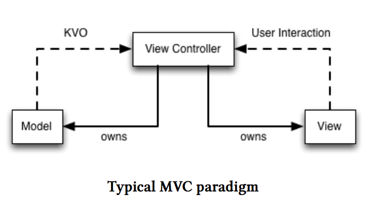

# 什么是MVVM

在传统的MVC架构的应用中，你有三种组件：数据模型、视图以及试图控制器。数据模型保持你的数据，而视图用来呈现这些数据。控制器介于这两个组件之间调解所有的交互。

这种中介(调解者)非常重要，数据模型不应该关心视图，反之亦然，一切都通过视图控制器来进行。在典型的iOS应用中，数据模型们都非常“薄(轻)”，意味着他们不包含业务逻辑。视图都属于UIKit，因此我们寄希望于Apple已经很好地测试过它的业务逻辑了。剩下的视图控制器它很少进行单元测试。

当新的数据到达时，model会通知ViewController（通常是通过键-值观察(KVO)的方式），然后ViewController会更新View。当View接收交互时，ViewController会更新Model。

正如你所看到的ViewController隐式地负责很多事情：验证输入、将模型数据映射到面向用户的信息、操作视图层次结构等等。 

MVVM将大量的类似上面的业务逻辑从viewController中抽离出来了。

